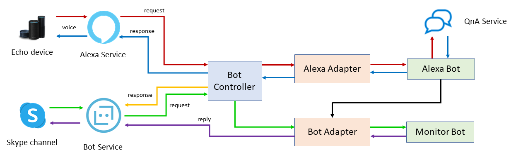

# alexa-bot-demo

Alexa and Azure integration demo with Bot Framework.

## Overview

- Get voice input from Echo device through Alexa service, and process it in a Bot Framework bot, to access QnA service in Azure.
- Monitor the Alexa conversation through a separate Skype bot.

## General diagram



## Code fragments

### Configuration

```cs
public class Startup
{
    //...
    public IConfiguration Configuration { get; }

    public void ConfigureServices(IServiceCollection services)
    {
        //...
        // ** Adapters
        services.AddSingleton<IAdapterIntegration, BotAdapterWithErrorHandler>();
        services.AddSingleton<IBotFrameworkHttpAdapter, AlexaAdapterWithErrorHandler>();

        // ** Bot state
        services.AddSingleton<IStorage, MemoryStorage>();
        services.AddSingleton<UserState>();
        services.AddSingleton<BotStateAccessors>();
        // Conversation reference temporal store
        services.AddSingleton<BotConversation>();

        // ** Bots
        services.AddTransient<AlexaBot>();
        services.AddTransient<MonitorBot>();
    }
    //...
}
```

Dependency Injection (DI) registrations:

- Adapters
- Bot state
- Bots

### Dual Controller

```cs
[ApiController]
public class BotController : ControllerBase
{
    //...

    public BotController(
        ObjectLogger objectLogger,
        IAdapterIntegration botAdapter,
        IBotFrameworkHttpAdapter alexaAdapter,
        AlexaBot alexaBot,
        MonitorBot monitorBot)
    {
        //...
    }

    [HttpPost("api/alexa")]
    public async Task AlexaPostAsync()
    {
        Request.EnableBuffering();

        // ** Get request body information
        using (var reader = new StreamReader(Request.Body))
        {
            var body = await reader.ReadToEndAsync();
            var bodyObject = JsonConvert.DeserializeObject<JObject>(body);
            var sessionId = bodyObject["session"]["sessionId"].Value<string>();

            // ** Log object details
            _objectLogger.SetSessionId(sessionId);
            await _objectLogger.LogObjectAsync(body, HttpContext.TraceIdentifier);

            Request.Body.Position = 0;

            // ** Pass request to Alexa adapter
            await _alexaAdapter.ProcessAsync(Request, Response, _alexaBot);
        }
    }

    [HttpPost("api/messages")]
    public async Task<InvokeResponse> BotPostAsync([FromBody]Activity activity)
    {
        var authHeader = Request.Headers["Authorization"];

        // ** Call bot adapter (as IAdapterIntegration)
        return await _botAdapter.ProcessActivityAsync(authHeader, activity, _monitorBot.OnTurnAsync, default);
    }
}
```

- Get request body information
- Log object details
- Pass request to Alexa adapter
- Call bot adapter (as `IAdapterIntegration`)

### Monitor bot

```cs
public class MonitorBot : ActivityHandler
{
    //...

    public MonitorBot(
        ObjectLogger objectLogger,
        BotConversation conversation)
    {
        //...
    }

    //...

    protected override async Task OnMessageActivityAsync(ITurnContext<IMessageActivity> turnContext, CancellationToken cancellationToken)
    {
        var message = turnContext.Activity.Text?.ToLower();

        switch (message ?? "")
        {
            case "monitor alexa":

                // ** Save conversation reference to send proactive messages
                _conversation.Reference = turnContext.Activity.GetConversationReference();
                await turnContext.SendActivityAsync($@"Alexa monitor is on");

                return;
        }

        // ** Echo back whatever else
        await turnContext.SendActivityAsync($"Echo from MonitorBot: \"**{turnContext.Activity.Text}**\"");
    }

}
```

- Save conversation reference to send proactive messages.
- Echo back whatever else

### Alexa bot - Event handling

```cs
public class AlexaBot : ActivityHandler
{
    //...

    public AlexaBot(
        ILogger<AlexaBot> logger,
        ObjectLogger objectLogger,
        IConfiguration configuration,
        IAdapterIntegration botAdapter,
        BotConversation conversation,
        BotStateAccessors accessors,
        QnAMakerEndpoint endpoint)
    {
        //...

        // ** Bot adapter (to send proactive message)
        _botAdapter = botAdapter;

        // ** Bot state handling
        _conversation = conversation;
        _accessors = accessors;

        // ...
    }

    public override async Task OnTurnAsync(ITurnContext turnContext, CancellationToken cancellationToken = default)
    {
        await _objectLogger.LogObjectAsync(turnContext.Activity, turnContext.Activity.Id);
        await base.OnTurnAsync(turnContext, cancellationToken);

        // ** Save bot state changes
        await _accessors.SaveChangesAsync(turnContext);
    }

    protected override async Task OnEventActivityAsync(ITurnContext<IEventActivity> turnContext, CancellationToken cancellationToken)
    {
        // ** Echo event information to monitor bot
        await EchoEventAsync(turnContext);

        switch (turnContext.Activity.Name)
        {
            case "LaunchRequest":
                await HandleLaunchRequestAsync(turnContext, cancellationToken);
                return;

            case "StopIntent":
                await turnContext.SendActivityAsync(MessageFactory.Text("Terminando la sesión", inputHint: InputHints.IgnoringInput));
                return;
        }

        // ** Speak back any other event
        await turnContext.SendActivityAsync(
            $"Event received: {turnContext.Activity.Name}");
    }

    //...

    private async Task EchoEventAsync(ITurnContext<IEventActivity> turnContext)
    {
        // ** Nothing to do if no conversation reference
        if (_conversation.Reference == null) return;

        var eventValue = JsonConvert.SerializeObject(turnContext.Activity.Value, Formatting.Indented);
        var botAppId = string.IsNullOrEmpty(_configuration["MicrosoftAppId"]) ? "*" : _configuration["MicrosoftAppId"];

        // ** Send proactive message
        await _botAdapter.ContinueConversationAsync(botAppId, _conversation.Reference, async (context, token) =>
        {
            await context.SendActivityAsync($"Event received:\n```\n{eventValue}\n```");
        });
    }

    //...

    private async Task HandleLaunchRequestAsync(ITurnContext<IEventActivity> turnContext, CancellationToken cancellationToken)
    {
        var alexaConversation = await _accessors.AlexaConversation.GetAsync(turnContext, () => new AlexaConversation());
        var game = alexaConversation.TurnControl >= 0
            ? "Ahora estamos jugando a que tú me haces preguntas."
            : "seguimos con el mismo juego, dime cualquier cosa para repetirla.";

        var greetingMessage = string.IsNullOrEmpty(alexaConversation.UserName)
            ? $"Hola, soy un demo de Alexa con Bot Framework y voy a repetir todo lo que digas, para empezar, por favor, dime tu nombre"
            : $@"Hola {alexaConversation.UserName}, {game}";

        await turnContext.SendActivityAsync(MessageFactory.Text(greetingMessage, inputHint: InputHints.ExpectingInput));
    }
}
```

- Bot adapter (to send proactive message)
- Bot state handling
- Save bot state changes
- Echo event information to monitor bot
- Speak back any other event
- Nothing to do if no conversation reference
- Send proactive message

### Alexa bot - Message handling

```cs
public class AlexaBot : ActivityHandler
{
    //...

    public AlexaBot(
        //...
        QnAMakerEndpoint endpoint)
    {
        //...

        // ** QnA endpoint
        AlexaBotQnA = new QnAMaker(endpoint);
    }

    public QnAMaker AlexaBotQnA { get; private set; }

    protected override async Task OnMessageActivityAsync(ITurnContext<IMessageActivity> turnContext, CancellationToken cancellationToken)
    {
        // ** Echo user message to monitor
        await EchoUserMessageAsync(turnContext);

        var message = turnContext.Activity.Text.ToLower();
        var alexaConversation = await _accessors.AlexaConversation.GetAsync(turnContext, () => new AlexaConversation());

        _logger.LogInformation(@"----- Retrieved alexaConversation ({@AlexaConversation})", alexaConversation);

        // ** Handle goodbye message
        if (message == "adiós")
        {
            await turnContext.SendActivityAsync(MessageFactory.Text($"Adiós {alexaConversation.UserName}!"), cancellationToken);

            // Reset user name for next interaction
            alexaConversation.UserName = null;
            await _accessors.AlexaConversation.SetAsync(turnContext, alexaConversation);

            return;
        }

        var replyMessage = string.Empty;

        if (alexaConversation.UserName is null)
        {
            alexaConversation.UserName = message;

            replyMessage = $"Gracias {message}, ahora sí voy a repetir lo que digas.";
        }
        else if (alexaConversation.TurnControl < 0)
        {
            replyMessage = $"{alexaConversation.UserName}, dijiste {turnContext.Activity.Text}";
        }
        else if (alexaConversation.TurnControl == 0)
        {
            replyMessage = $"A ver {alexaConversation.UserName}, esto está un poco aburrido, mejor hazme preguntas.";
        }
        else
        {
            // ** Search QnA service
            replyMessage = await FindAnswerAsync(turnContext, cancellationToken);
        }

        alexaConversation.TurnControl++;

        await _accessors.AlexaConversation.SetAsync(turnContext, alexaConversation);

        await EchoBotMessageAsync(turnContext, replyMessage);

        // ** Speak back reply message
        await turnContext.SendActivityAsync(MessageFactory.Text(replyMessage, inputHint: InputHints.ExpectingInput), cancellationToken);
    }

    private async Task EchoBotMessageAsync(ITurnContext<IMessageActivity> turnContext, string message)
    {
        // Similar to EchoEventAsync
    }

    private async Task EchoUserMessageAsync(ITurnContext<IMessageActivity> turnContext)
    {
        // Similar to EchoEventAsync
    }

    private async Task<string> FindAnswerAsync(ITurnContext<IMessageActivity> turnContext, CancellationToken cancellationToken)
    {
        var results = await AlexaBotQnA.GetAnswersAsync(turnContext);

        if (results.Length == 0)
        {
            var alexaConversation = await _accessors.AlexaConversation.GetAsync(turnContext, () => new AlexaConversation());

            return $"Perdona {alexaConversation.UserName}, pero no tengo respuesta para eso, prueba preguntarme otra cosa.";
        }

        return results.First().Answer;
    }

    private async Task HandleLaunchRequestAsync(ITurnContext<IEventActivity> turnContext, CancellationToken cancellationToken)
    {
        // ** Set up welcome (back) message
        var alexaConversation = await _accessors.AlexaConversation.GetAsync(turnContext, () => new AlexaConversation());
        var game = alexaConversation.TurnControl >= 0
            ? "Ahora estamos jugando a que tú me haces preguntas."
            : "seguimos con el mismo juego, dime cualquier cosa para repetirla.";

        var greetingMessage = string.IsNullOrEmpty(alexaConversation.UserName)
            ? $"Hola, soy un demo de Alexa con Bot Framework y voy a repetir todo lo que digas, para empezar, por favor, dime tu nombre"
            : $@"Hola {alexaConversation.UserName}, {game}";

        await turnContext.SendActivityAsync(MessageFactory.Text(greetingMessage, inputHint: InputHints.ExpectingInput));
    }
}
```

- QnA endpoint
- Echo user message to monitor
- Handle goodbye message
- Search QnA service
- Speak back reply message
- Set up welcome (back) message

## Resources

- **How does a Bot Builder v4 bot work?** \
  <https://www.coderepo.blog/posts/how-does-a-bot-builder-v4-bot-work/>

- **How to send a proactive message with Bot Builder v4?** \
  <https://www.coderepo.blog/posts/how-to-send-proactive-message-bot-builder-v4/>

- **Bot Builder Community .NET - adopt-alexadotnet branch** \
  <https://github.com/BotBuilderCommunity/botbuilder-community-dotnet/tree/feature/adopt-alexadotnet/libraries/Bot.Builder.Community.Adapters.Alexa>

- **Echo bot sample using Alexa Adapter** \
  <https://github.com/BotBuilderCommunity/botbuilder-community-dotnet/tree/feature/adopt-alexadotnet/samples/Alexa%20Adapter%20Sample>

- **NuGet feed Bot Builder Community** \
  <https://www.myget.org/F/botbuilder-community-dotnet/api/v3/index.json>

